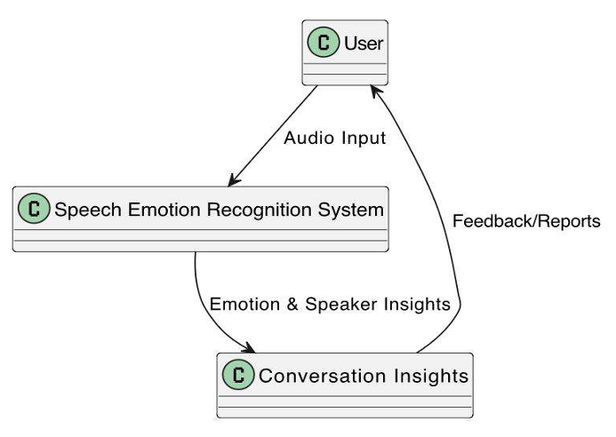
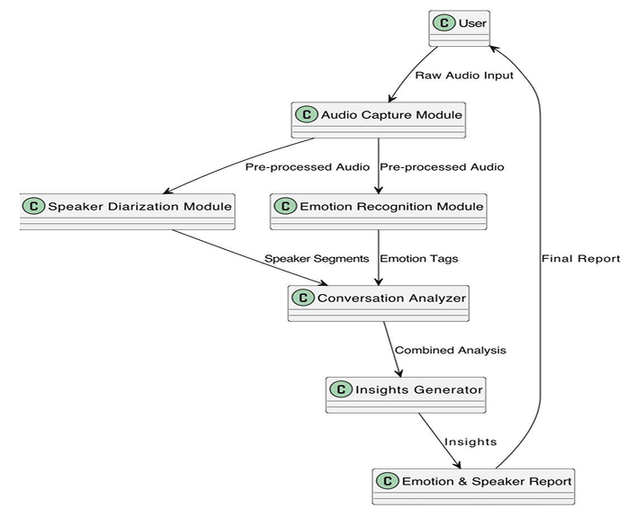

# speech-emotion-recognition-system
Speech Emotion Recognition system with Speaker Diarization and Emotion Analysis for Enhanced multi-speaker conversations.

## EXECUTIVE SUMMARY
The project "Speech Emotion Recognition with Speaker Diarization and Emotion Analysis for Enhanced Conversation" presents a real-time AI framework designed to detect and interpret emotions in spoken conversations. Traditional sentiment analysis approaches rely mainly on text input and often fail to capture important emotional cues embedded in speech, such as tone, pitch, and prosody.

To address these limitations, the proposed system integrates "Speech Emotion Recognition (SER)" with "Speaker Diarization" and "Explainable AI (XAI)" to deliver an emotionally aware and context-sensitive solution. The framework leverages advanced machine learning models, including "OpenAI Whisper" for robust multilingual speech-to-text transcription, "PyAnnote" for accurate speaker segmentation, and transformer-based NLP models such as "RoBERTa" and "DistilBERT" for sentiment-aware emotion classification.

A key strength of the system is its ability to process "multi-speaker audio", associate detected emotions with specific speakers, and provide real-time visual feedback through a "Flask-based web interface". Emotions such as happiness, sadness, anger, and neutrality are identified along with confidence scores, while XAI components enhance transparency by presenting emotional trends and speaker timelines.

Through optimized preprocessing, parallelized execution, and GPU acceleration, the system demonstrates strong real-time performance, scalability, and adaptability across languages and domains. The project serves as both a functional prototype and a research contribution, offering a comprehensive approach toward building emotionally intelligent AI systems for applications such as mental health monitoring, virtual education, and AI- driven customer support.

## INTRODUCTION
### Background

Speech Emotion Recognition (SER), combined with real-time sentiment analysis, plays a key role in building emotionally intelligent AI systems for domains such as healthcare, customer support, education, and human-computer interaction. Traditional sentiment analysis methods are mostly text-based and often fail to capture critical cues present in speech, such as tone, pitch, and prosody.

To overcome this limitation, the project introduces a real-time framework that integrates both speech and text-based emotion analysis. The system leverages "OpenAI Whisper" for accurate multilingual speech transcription, "PyAnnote" for speaker diarization in multi-speaker conversations, and transformer-based NLP models such as "RoBERTa" and "DistilBERT" for sentiment-aware emotion classification. Unlike conventional SER approaches that depend on handcrafted audio features (MFCCs, spectrograms), this solution adopts an end-to-end deep learning pipeline for improved adaptability and contextual understanding.

### Motivation

The motivation behind this project stems from the growing need for AI systems that can understand and respond to human in real time. Text-only analysis often leads to incomplet emotional interpretation, reducing the effectiveness of conversational agents, mental health tools, and virtual assistants.

By enabling emotion-aware speech processing, the system can support sensitive applications such as early distress detection in mental health monitoring, empathetic customer service automation, and more natural human-like interactions in AI assistants. Additionally, Explainable AI (XAI) components provide confidence scores and emotion visualizations, improving transparency and user trust.

### Scope of the Project
The project focuses on developing a scalable and real-time SER framework capable of:

- Detecting emotions from spoken conversations.
- Handling multi-speaker audio through speaker diarization.
- Performing multilingual transcription and sentiment-aware emotion classification.
- Providing speaker-specific emotion timelines and visual insights via a Flask-based interface.

The system is designed for real-world deployment in areas such as healthcare support, virtual education, intelligent tutoring systems, and AI-driven customer engagement platforms. By combining speech processing, transformer-based emotion inference, and explainable feedback, the project aims to advance emotionally intelligent and human-centric AI communication.

## RESEARCH GAPS ADDRESSED
Despite significant progress in Speech Emotion Recognition (SER) and sentiment analysis, several limitations still reduce the real-world effectiveness of current systems. The project aims to bridge these gaps through an advanced, real-time, and explainable framework.

### Key Gaps: Identified & Proposed Solutions

- **Limited Context Awareness:** Most SER models analyze utterances in isolation, failing to capture emotional flow across conversational turns.
  *Solution:* Transformer-based models (RoBERTa, DistilBERT) are integrated with diarized speech to preserve dialogue continuity.

- **Dependence on Handcrafted Features:** Traditional approaches rely heavily on MFCCs and spectrograms, which are sensitive to noise, accents, and tuning bias.
  *Solution:* End-to-end deep learning representations (e.g., HuBERT) reduce feature engineering dependency and improve generalization.

- **Real-time Processing Latency:** Deep learning SER pipelines often suffer from high computational cost, limiting live deployment.
  *Solution:* Optimized parallel execution enables simultaneous transcription, diarization, and emotion interference for low-latency performance.

- **Lack of Multimodal Emotion Fusion:** Many systems process only speech or text independently, missing complementary emotional cues.
  *Solution:* This framework combines prosodic speech signals with semantic text understanding for richer emotion classification.

- **Language and Accent Variability:** Existing SER models underperform across multilingual and diverse accent scenarios due to dataset bias.
  *Solution:* Whisper's multilingual transcription and HuBERT's robust speech embeddings enhance cross-lingual adaptability.

- **Emotion Ambiguity and Overlap:** Emotions such as anger, frustration, or excitement often overlap, making classification difficult.
  *Solution:* Joint speech-text modeling improves disambiguation of subtle emotional expressions.

- **Lack of Explainability:** Most SER systems provide predictions without transparency, reducing trust in sensitive applications.
  *Solution:* Explainable AI (XAI) modules visualize confidence scores, emotion trends, and speaker timelines for interpretability.

By addressing these gaps, the project delivers a scalable, context-aware, multilingual, and explainable SER framework suitable for real-world human-centric AI applications.

## PROBLEM STATEMENT
Speech is one of the richest forms of human communication, conveying not only words but also emotional cues through tone, pitch, and prosody. However, most traditional sentiment analysis systems rely maninly on text input and fail to capture these acoustic emotional dimensions, leading to incomplete or inaccurate emotion interpretation.

Existing Speech Emotion Recognition (SER) models face several challenges, including:

- Limited contextual understanding across conversational turns
- Difficulty handling multi-speaker conversations
- High latency in real-time applications
- Poor adaptability to multilingual speech and accent variations
- Lack of transparency due to black-box deep learning predictions

To address these limitations, this project proposes a **real-time, explainable Speech Emotion Recognition framework** that combines speech transcription, speaker diarization, transformer-based emotion classification, and emotion visualization to enhance emotionally intelligent AI interactions.

## OBJECTIVES
The primary objective of this project is to design and implement a **real-time Speech Emotion Recognition (SER) system** integrated with sentiment-aware analysis to improve the emotional intelligence of AI-driven conversational applications.

### Key Objective Include:
- **Real-Time Emotion Detection:** Develop an end-to-end pipeline capable of detecting emotions from spoken conversations with low latency.
- **Multilingual Speech Transcription:** Use **OpenAI Whisper** to generate accurate speech-to-text transcriptions even undder noisy conditions and diverse accents.
- **Speaker-Level Emotion Association:** Apply **PyAnnote Speaker Diarization** to separate multiple spekers and map emotions to individual voices.
- **Context-Aware Emotion Classification:** Leverage transformer-based NLP models (**RoBERTa, DistilBERT**) to classify emotions such as happiness, sadness, anger, fear and neutrality.
- **Explainable AI Integration (XAI):** Provide interpretable outputs through confidence scores, emotion timelines, and real-time visual feedback for improved trust.

By achieving these objectives, the project delivers a scalable, context-aware, and emotionally intelligent AI framework that enhances human-computer interaction.

## PROJECT PLAN & DEVELOPMENT PHASES
The project was executed in a structured multi-phase workflow to ensure scalability, accuracy, and real-time performance.

### Phase 1: Research & Requirement Analysis
- Reviewed existing work in Speech Emotion Recognition (SER), speaker diarization, and sentiment analysis
- Identified key challenges such as real-time latency, lack of interpretability, and speaker-level emotion attribution
- Defined functional and non-functional requirements
- Finalized tools: Python, Whisper, PyAnnote, Transformers and Flask

### Phase 2: Data Collection & Preprocessing
- Collected labeled emotional speech datasets for training and evaluation
- Standardized audio into **16kHz mono WAV format**
- Generated speech-to-text transcripts using Whisper
- Performed consistency and quality checks for reliable model performance

### Phase 3: Model Selection & Implementation
- Integrated core modules:
  - Whisper for transcription
  - PyAnnote for speaker diarization
  - RoBERTa / DistilBERT for emotion classification
- Developed a unified pipeline for multi-speaker emotion analysis

### Phase 4: Training & Optimization
- Fine-tuned transformer-based emotion classifiers on the dataset
- Optimized hyperparameters to improve accuracy and reduce processing latency
- Evaluated performance using precision, recall, F1-score, and inference time

### Phase 5: System Integration & Real-Time Processing
- Built a Flask-based web application for audio upload and analysis
- Integrated transcription, diarization, and emotion detection into a real-time workflow
- Designed an interactive UI displaying speaker-wise emotions and confidence scores

### Phase 6: Testing & Validation
- Tested the system on real-world multi-speaker audio samples
- Assessed scalability, robustness, and response time under diverse conditions
- Conducted usability testing to refine emotion visualization and output clarity

### Phase 7: Deployment & Documentation
- Deployed the system in a local GPU/cloud-supported environment for demonstration
- Prepared technical documentation, API usage guides, and user instructions
- Finalized the project with a live working prototype and presentation of outcomes

This phased approach ensured the delivery of a scalable, real-time, and explainable SER framework for emotionally intelligent AI applications.

## REQUIREMENTS
- Python 3.9+
- GPU recommended for faster inference
- HuggingFace + PyAnnote access tokens

## DESIGN APPROACH AND DETAILS
### System Architecture

This project follows an end-to-end real-time pipeline:
- Audio upload via Flask Interface
- Preprocessing & Standardization
- Speaker Diarization using PyAnnote
- Speech-to-Text Transcription using Whisper
- Emotion Classification using RoBERTa/DistilBERT
- Explainable AI Visualization (Emotion Trends + Confidence Scores)

### Detailed Components Breakdown

#### 1. Audio Input & Preprocessing
- Users upload speech samples via a Flask web interface.
- Audio is standardized to 16kHz WAV format for consistent processing.
- Inputs are assumed pre-cleaned (no extra noise removal).

#### 2. Speech-to-Text Transcription (Whisper)
- OpenAI Whisper is used to transcribe speech into text.
- Provides accurate transcription across accents, noise, and conversational speech.
- Output: Clean text transcript.

#### 3. Speaker & Emotion Processing
- PyAnnote performs speaker diarization to identify who spoke when.
- RoBERTa and DistilBERT analyze transcribed segments for emotion detection.
- Enables speaker-wise emotion mapping in multi-speaker conversations.

#### 4. Emotion Classification
- Detects key emotions such as:
  - Happiness
  - Sadness
  - Anger
  - Fear
  - Neutrality

- Outputs emotion labels with confidence scores.
- Final predictions are generated at the speaker level.

#### 5. Explainability & Visualization (XAI)
- A Flask-based interface displays results in real time, including:
  - Speaker-wise emotion breakdown
  - Emotion probability scores
  - Annotated transcripts
  - Time-aligned emotion trends
 
### Design
#### Data Flow Diagram (DFD)
The Data Flow Diagram (DFD) represents how audio input is processed through the Speech Emotion Recognition system.

##### Level 0:
At Level 0, the system is viewed as a single process interacting with the user:
- The user provides raw conversation audio.
- The system analyzes the speech to detect emotions and speaker information.
- The output is returned as structured emotional insights.

##### Level 1:
At Level 1, the system is divided into internal modules:

1. **Audio Capture & Preprocessing:** Receives and standardizes the uploaded audio.
2. **Speaker Diarization Module:** Identifies speaker segments and separates voices.
3. **Emotion Recognition Module:** Detects emotional states from speech and transcribed text.
4. **Conversation Analyzer:** Maps emotions to specific speakers across the timeline.
5. **Insights Generator:** Produces the final emotion and speaker-wise report for the user.

This flow highlights the complete pipeline from audio input to interpretable emotional output.

#### Class Diagram
The Class Diagram represents the object-oriented structure of the Speech Emotion Recognition system.
It follows a modular design where each class is responsible for a specific task in the pipeline.

- **AudioInput** handles user-uploaded audio files.
- **Preprocessing** prepares the audio through normalization and standardization.
- **FeatureExtractor** extracts relevant speech features for analysis.
- **SpeakerDiarization** identifies and segments different speakers.
- **EmotionRecognition** detects emotions from speech or transcript patterns.
- **ConversationAnalyzer** combines speaker turns with emotional states.
- **ReportGenerator** produces the final structured emotion and conversation report.

Supporting classed such as **SpeakerSegments**, **EmotionLabels**, and **AnalyzedData** ensure clean data handling and scalability.

## METHODOLOGY AND TESTING
### Dataset
The project doesn't depend on a fixed pre-collected dataset.
Instead, it performs **real-time inference** on user-uploaded speech recordings.

Users can upload audio in formats such as:
- `.mp3`
- `.wav`
- `.m4a`
- `.mp4`

The system processes the input live using pre-trained models:
- **Whisper (OpenAI)** for speech-to-text transcription
- **PyAnnote** for speaker diarization
- **Transformer-based emotion classifier** (RoBERTa / DistilBERT) for emotion detection

Since the system works directly on user-provided audio, it is:
- Domain-independent
- Personalized to user context
- Privacy-aware (no large dataset storage required)

This makes the approach scalable and suitable for real-world applications such as telehealth, customer support, and education.

### Module Description
#### 1. Model Loading Module
Initializes all required deep learning models:
- Whisper for transcription
- PyAnnote for diarization
- Transformer models for emotion classification

Supports dynamic CPU/GPU selection for efficient inference.

#### 2. Audio Preprocessing Module
Standardizes uploaded audio into a uniform format:
- 16kHz sample rate
- Mono-channel WAV conversion

Ensures compatibility and improves transcription reliability.

#### 3. Speaker Diarization Module
Identifies and segments speech based on speaker identity.

- Detects speaker turns with timestamps
- Enables speaker-wise emotion tracking

Essential for multi-speaker conversations.

#### 4. Emotion Analysis Module
Classifies emotions from diarized transcripts using transformers.

Detects emotions such as:
- Happiness
- Sadness
- Anger
- Fear
- Neutrality

Produces both segment-level and overall emotion summaries.

#### 5. Web Interface Module
Provides an interactive Flask-based interface for users.

- Audio upload support
- Real-time emotion results
- JSON output + optional visualizations

Makes the system accessible without coding knowledge.

#### 6. Core Processing Pipeline Module
Orchestrates the complete end-to-end workflow:

1. Audio preprocessing
2. Transcription (Whisper)
3. Speaker diarization (PyAnnote)
4. Emotion classification (Transformers)
5. Structured report generation

This module forms the backbone of the real-time SER system.

## RESULT AND DISCUSSION
The proposed Speech Emotion Recognition system was successfully deployed using a Flask-based web application and tested on real-time user-uploaded audio inputs. The system accurately performed speech transcription, speaker diarization, and emotion classification, producing speaker-wise emotional insights.

### RESULT
#### Final Output
**Output 1:** 
[!Output 1](documents/results/Output_1.png)

**Output 2:**
[!Output 2](documents/results/Output_2.png)

**Output 3:**
[!Output 3](documents/results/Output_3.png)

#### Summary of Performance
**Comparison with Traditional SER Systems:**

| Approach | Traditional SER Models | Proposed System |
|----------|------------------------|-----------------|
| Feature Extraction | MFCC / Spectrogram | Transformer embeddings |
| Speaker Handling | Not Supported | Speaker diarization enabled |
| Real-Time Support | Limited | Full Flask deployment |
| Explainability | Low | Emotion timeline + confidence output |

**Emotion Classification and Accuracy Comparison:**
[!Emotion Classification and Accuracy Comparison](documents/results/emotion_classification_and_accuracy_comparison.png)

**Diarization Error Rate (DER):**
[!Diarization Error Rate](documents/results/diarization_error_rate.png)

**Latency Comparison for Real-Time Inference:**
[!Latency Comparison for Real-Time Inference](documents/results/latency_comparison_for_realtime_inference.png)

**Emotion Detection Confidence Levels:**
[!Emotion Detection Confidence Levels](documents/results/emotion_detection_confidence_levels.png)

**Multi-Speaker Emotion Attribution Accuracy:**
[!Multi-Speaker Emotion Attribution Accuracy](documents/results/multispeaker_emotion_attribution_accuracy.png)
